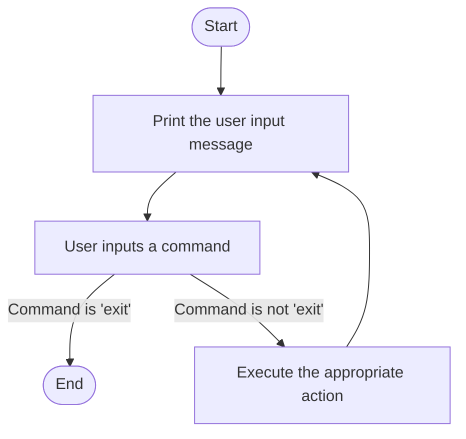
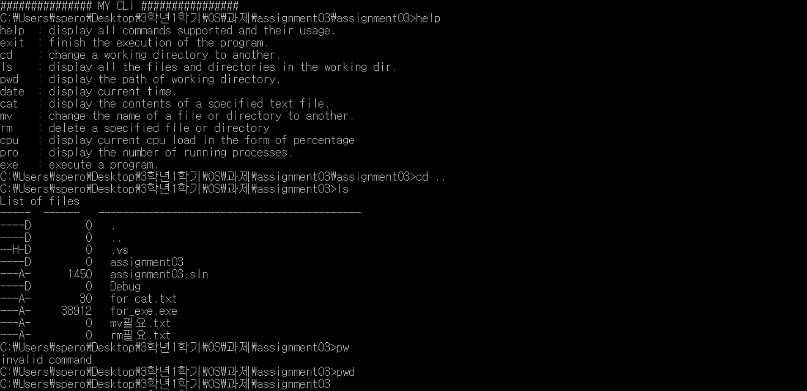
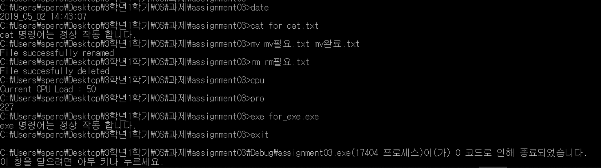

# cli

## Project Stack

* C++

## Project Description

### Implemented Commands

* cat
* cd
* cpu
* date
* exe
* help
* ls
* mv
* pro
* pwd
* rm

### Flow Chart

```mermaid
graph TD
    A([Start]) --> C[Print the user input message]
    C --> D[User inputs a command]
    D -- Command is 'exit' --> E([End])
    D -- Command is not 'exit' --> F[Execute the appropriate action]
    F --> C
```

### Result

